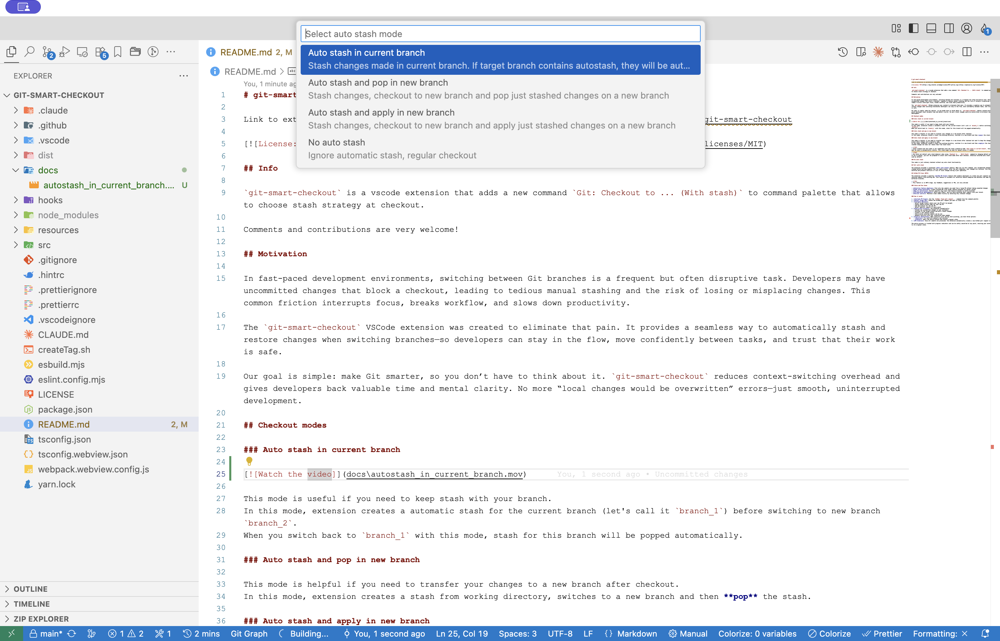

# Checkout with Stash

Command: `Git Smart Checkout: Checkout to ... (With Stash)`

Use this command to switch to a local branch, remote branch, or tag while the extension protects your uncommitted changes according to the selected stash mode.

## What It Does

1. Opens a branch picker for local branches, remote branches, and tags.
2. Shows commit details, author, relative date, and upstream ahead/behind information when available.
3. Marks local branches that are already checked out in another worktree with a folder icon.
4. Lets you star preferred refs so they stay easy to find in this repository.
5. Lets you create a new branch from the current branch, or create a new branch from a selected base ref.
6. Uses the configured stash mode, or asks you to choose one when the mode is `manual`.
7. Checks out the selected ref.
8. Pulls the branch after checkout when the selected branch has an upstream.
9. Restores or transfers local changes depending on the stash mode.

When `git-smart-checkout.useFastBranchList` is enabled, the picker opens from VS Code's cached Git model. Before the picker appears, the extension preloads missing or expired details for the first visible refs and applies any valid cached details immediately. Details are cached for 48 hours and are invalidated when a ref points to a different commit.

After the picker opens, the extension refreshes remaining missing or expired details in the background. If you focus a ref whose details are still missing, the same cache-backed enrichment is used as a fallback.

If a branch is already checked out in another Git worktree, the checkout picker shows a folder icon next to that local branch before you select it.

## Stash Modes

| Mode | Behavior |
| --- | --- |
| Auto stash in current branch | Stashes changes for the current branch before checkout. When you later return to that branch with the same mode, the matching stash is popped automatically. |
| Auto stash and pop in new branch | Stashes current changes, checks out the target branch, then pops the stash onto the target branch. |
| Auto stash and apply in new branch | Stashes current changes, checks out the target branch, then applies the stash onto the target branch while keeping the stash entry available. |
| No auto stash | Runs checkout without automatic stash handling. Git may block the checkout if local changes would be overwritten. |

> [!TIP]
> Set the default behavior with `Git Smart Checkout: Switch Mode` or the status bar item. When the mode is `manual`, this command asks you to select a stash mode each time.

> [!TIP]
> Stashes created by "Auto stash and apply in new branch" are not used by the automatic branch-restore flow. They remain available for manual stash access.

## Conflict Pre-Flight

For auto stash and pop/apply modes, Git 2.38 or newer allows the extension to preview stash conflicts before switching branches. If conflicts are predicted, you can cancel before the checkout changes your working tree.

## Media

[Auto stash in current branch video](media/autostash_in_current_branch.mov)
